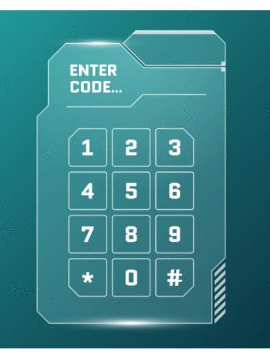

<h1 align="center">Numpad Using Biometric System</h1>

The Biometric Authentication System is a comprehensive solution that combines cutting-edge technology with user-centric design to provide a secure, efficient, and convenient method of access control using numpad input.

## Requirements

- [Node > v16](https://nodejs.org/en/)
- [Yarn](https://yarnpkg.com/getting-started/install) / [npm](https://docs.npmjs.com/cli/v10/commands/npm-install)

_A basic understanding of modern web development workflows. If you're unfamiliar with these, React might not be suitable for you at this stage._

## About The Project



The Biometric System is designed to provide secure and efficient access control using a numpad for code entry. This system ensures high security and quick access by leveraging user-centric design and advanced authentication technology.

### Built With

This project was built with the following technologies:

- [React](https://react.dev/)
- [Typescript](https://www.typescriptlang.org/)

## Getting Started

To get a local copy up and running follow these simple example steps.

### Installation

Please follow the following steps for successful installation:

1. **Clone the Repository:** Get started by cloning the repository to your local machine.

   ```
   https://github.com/Ruminatesoftware/Biometric.git
   ```

2. **Install Packages:** Navigate to the directory and install the required yarn packages by executing the following command in your terminal:

   ```sh
   yarn install
   ```

3. **Run the Project:** Finally, enter the following command in your terminal to start your server:

   ```sh
   yarn start
   ```

   Now, your application should be successfully up and running!

## Features

This setup includes some utilities and examples to use as a foundation.

1. **Initial Interaction:** The user begins by entering their access code using the designated numpad on the web interface.

2. **Redirect to Scan Section:** Once the access code is entered, the system simulates a fingerprint scanner animation.

3. **Authentication Process:** 

   i) If the access code matches a registered user in the system's database, an "Access Allowed" window is displayed, granting the user access.

   ii) If the access code does not match any registered user, an "Access Denied" window is shown, preventing unauthorized access.

## Contributing

Contributions are what make the open source community such an amazing place to learn, inspire, and create. Any contributions you make are **greatly appreciated**.

If you have a suggestion that would make this better, please fork the repo and create a pull request. You can also simply open an issue with the tag &quot;enhancement&quot;.
Don&#39;t forget to give the project a star! Thanks again!

1. Fork the Project
2. Create your Feature Branch (`git checkout -b feature/AmazingFeature`)
3. Commit your Changes (`git commit -m "Add some AmazingFeature"`)
4. Push to the Branch (`git push origin feature/AmazingFeature`)
5. Open a Pull Request

## License

Distributed under the [MIT license](LICENSE).

## Contact

If you have any questions or suggestions, feel free to reach out to us:

- Raise an issue on the repository: [GitHub Repository](https://github.com/Ruminatesoftware?tab=repositories)

## Acknowledgments

A special thanks to the following for their contributions, support and inspiration:

- [Ruminate Software](https://ruminate.gohero.us/)
